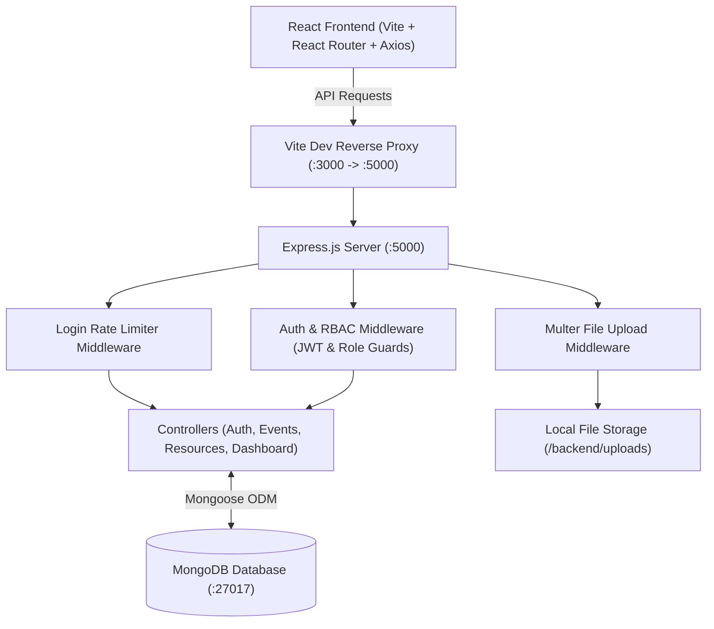
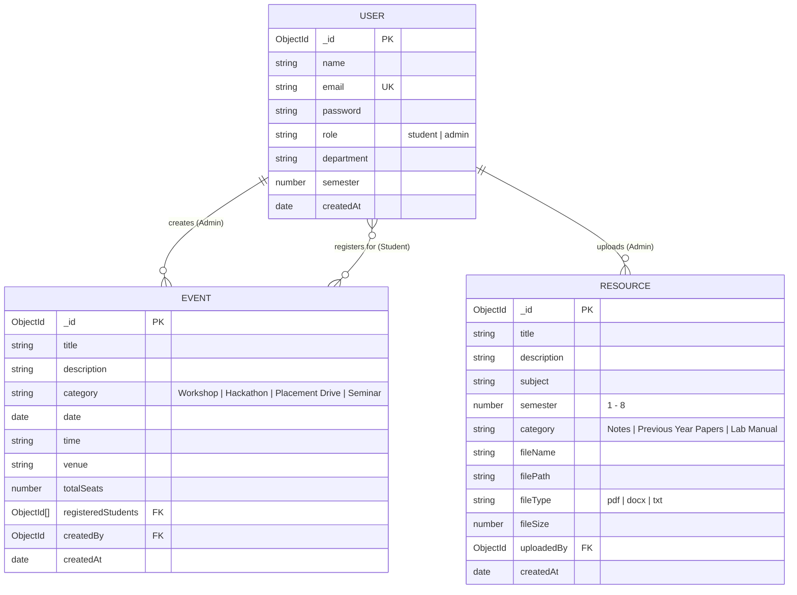

# 🎓 CampusConnect — Student Event & Resource Management Portal

> **Full Stack Development Lab — B.Tech CSE, 3rd Year Practice Project**  
> Built with simple, robust, production-ready code using the MERN stack (MongoDB, Express.js, React.js, Node.js).

---

## 📌 Problem Statement & Overview

**CampusConnect** is a college web application designed to bridge the gap between students and campus activities. 
- **Students** can browse upcoming events (workshops, hackathons, placement drives), register for them with real-time seat availability tracking, access academic resources (lecture notes, previous year question papers, lab manuals), and manage their registration history.
- **Faculty / Admins** can schedule and manage events, upload and categorize study materials, track student registration turnouts, and view/export attendee rosters.

---

## 🏗️ Architecture & ER Diagram

### System Architecture Flow



### Entity-Relationship (ER) Diagram



---

## 🛠️ Tech Stack

- **Frontend:** React 19, React Router v7, Axios, Lucide React icons, Responsive CSS Design System
- **Backend:** Node.js (v24), Express.js (v5)
- **Database:** MongoDB & Mongoose ODM
- **Authentication:** JSON Web Tokens (JWT) + Bcrypt password hashing
- **File Uploads:** Multer with mime-type checking and disk storage
- **Testing:** Node.js Native Test Runner (`node:test` + `node:assert/strict`)
- **CI/CD:** GitHub Actions workflow (`.github/workflows/ci.yml`)

---

## 🚀 Quick Setup & Installation

### 1. Prerequisites
- **Node.js**: v18 or higher (tested on Node v24)
- **MongoDB**: Local MongoDB instance running on `localhost:27017` or MongoDB Atlas URI

### 2. Clone and Navigate
```bash
git clone <your-repository-url>
cd CampusConnect
```

### 3. Backend Setup
```bash
cd backend
npm install
```

Ensure `backend/.env` contains:
```env
PORT=5000
MONGO_URI=mongodb://127.0.0.1:27017/campusconnect
JWT_SECRET=campusconnect_super_secret_jwt_key_3rd_year_lab_2026
NODE_ENV=development
```

### 4. Seed the Database
Populate test accounts, sample events, and academic resources with one command:
```bash
npm run seed
```

### 5. Frontend Setup
In a new terminal:
```bash
cd frontend
npm install
```

### 6. Run the Application
- **Start Backend:**
  ```bash
  cd backend
  npm run dev
  # Server will run on http://localhost:5000
  ```
- **Start Frontend:**
  ```bash
  cd frontend
  npm run dev
  # Application will be accessible at http://localhost:3000
  ```

---

## 🔑 Demo Login Credentials

The database seeder pre-configures two test accounts:

| Role | Email | Password | Permissions |
| :--- | :--- | :--- | :--- |
| **Faculty / Admin** | `admin@campusconnect.edu` | `admin123` | Create/edit/delete events, upload resources, view attendees, analytics |
| **Student** | `student@campusconnect.edu` | `student123` | Browse events, 1-click register/unregister, download study resources |

*(Note: On the login page, 1-click demo filler buttons are provided for instant testing!)*

---

## 📡 API Documentation

### 1. Authentication Endpoints (`/api/auth`)
| Method | Endpoint | Access | Description |
| :--- | :--- | :--- | :--- |
| `POST` | `/api/auth/register` | Public | Register new student or admin |
| `POST` | `/api/auth/login` | Public (Rate-limited) | Authenticate user & return JWT token |
| `GET` | `/api/auth/me` | Authenticated | Retrieve current user profile |

### 2. Events Endpoints (`/api/events`)
| Method | Endpoint | Access | Description |
| :--- | :--- | :--- | :--- |
| `GET` | `/api/events` | Public | List events with `search`, `category`, `filter` (upcoming/past), and `page` |
| `GET` | `/api/events/:id` | Public | Get single event details with available seats |
| `POST` | `/api/events` | Admin Only | Create new event with total seats capacity |
| `PUT` | `/api/events/:id` | Admin Only | Update event details |
| `DELETE` | `/api/events/:id` | Admin Only | Delete an event |
| `POST` | `/api/events/:id/register` | Student | Register student; decrements available seats |
| `POST` | `/api/events/:id/unregister`| Student | Cancel event registration; frees up seat |
| `GET` | `/api/events/:id/attendees` | Admin Only | Get full attendee roster with student details |

### 3. Academic Resources Endpoints (`/api/resources`)
| Method | Endpoint | Access | Description |
| :--- | :--- | :--- | :--- |
| `GET` | `/api/resources` | Public | List materials with `semester`, `subject`, `category`, and `page` |
| `GET` | `/api/resources/:id` | Public | Get resource metadata |
| `POST` | `/api/resources` | Admin Only | Upload PDF/DOCX file with metadata (Multer) |
| `GET` | `/api/resources/:id/download` | Public | Download file directly from storage |
| `DELETE` | `/api/resources/:id` | Admin Only | Delete resource document and file from disk |

### 4. Dashboards & Analytics (`/api/dashboard`)
| Method | Endpoint | Access | Description |
| :--- | :--- | :--- | :--- |
| `GET` | `/api/dashboard/student` | Student | My events, registration history, recommended materials |
| `GET` | `/api/dashboard/admin` | Admin Only | Total events, total registrations, popular events, fill rate |
| `GET` | `/api/dashboard/benchmark` | Admin Only | Database query indexing performance benchmark |

---

## 🏆 Bonus Challenges Implementation

### 1. Role-Based Access Control (RBAC) Middleware
Implemented in `backend/middleware/role.js`:
```javascript
const authorize = (...roles) => {
    return (req, res, next) => {
        if (!roles.includes(req.user.role)) {
            return res.status(403).json({
                success: false,
                message: `Access denied. Role '${req.user.role}' is not authorized.`
            });
        }
        next();
    };
};
```
Protects admin actions (creating events, deleting resources, viewing attendees) and student-only workflows.

### 2. Login Rate Limiting
Implemented in `backend/middleware/rateLimiter.js`:
- Restricts brute-force login attempts to **10 requests per 15 minutes** per IP.
- Returns HTTP `429 Too Many Requests` with a human-readable retry duration.

### 3. Backend Unit Tests (5 Core Test Cases)
Run the tests using:
```bash
cd backend
npm test
```
**Test Results:**
```
✔ 1. User Model - hashes password and prevents duplicate email registration (249ms)
✔ 2. Auth System - verifies valid JWT generation and payload verification (13ms)
✔ 3. Event Model - accurately calculates available seats based on totalSeats and registrations (11ms)
✔ 4. Event Registration Logic - student registration decrements available seats and blocks duplicates (83ms)
✔ 5. Resource Model - filters academic resources correctly by subject and semester (40ms)
✔ CampusConnect Backend Unit Tests (5 passed, 0 failed)
```

### 4. CI Pipeline (GitHub Actions)
Configured in `.github/workflows/ci.yml`:
- Spins up an Ubuntu container with a MongoDB 6.0 service container.
- Installs dependencies, runs all unit tests, and verifies the frontend production build.

### 5. Slow Query Index Optimization
- **Target Query:** Searching events by category and ordering by date (`find({ category: "Workshop" }).sort({ date: 1 })`).
- **Optimization:** Added compound index in `backend/models/Event.js`:
  ```javascript
  eventSchema.index({ category: 1, date: 1 });
  ```
- **Comparison & Metrics:**
  - *Before Indexing (COLLSCAN):* Scans full collection `O(N)`, examining every document in memory.
  - *After Indexing (IXSCAN):* Reads directly from B-Tree index `O(log N)` with `totalDocsExamined: nReturned`.
  - Accessible interactively in the **Admin Console** under the **"Database Query Index Optimization Benchmark"** card.

---

## 🎥 3–5 Minute Demo Walkthrough Script

When recording your demo video or presenting in the lab:
1. **Introduction (0:00 - 0:45):**
   - Introduce CampusConnect, its target audience (students and faculty), and explain the architecture (React + Express + MongoDB).
2. **Student Experience (0:45 - 2:00):**
   - Log in using student credentials (`student@campusconnect.edu`).
   - Browse upcoming workshops, demonstrate search and category filter.
   - Click an event, point out the remaining seat badge (e.g. "28 of 30 seats left"), and register.
   - Show how seat availability decrements immediately and reflects in "My Student Dashboard".
   - Navigate to "Study Resources", filter by Semester 6, and download a sample lecture note file.
3. **Faculty / Admin Experience (2:00 - 3:30):**
   - Sign in as Admin (`admin@campusconnect.edu`).
   - Show the Analytics Dashboard (Total Events, Total Registrations, Fill Rate Progress Bar).
   - Click "View Attendees" on an event to inspect registered student details and export the CSV roster.
   - Create a new workshop with seat limits.
   - Upload a new PDF/DOCX academic resource.
4. **Placement-Level Bonus & Testing (3:30 - 4:30):**
   - Open terminal and run `npm test` to show all 5 backend unit tests passing.
   - Show the GitHub Actions CI workflow file.
   - Demonstrate the DB Query Index Benchmark card in the Admin console.

---

## 📦 Deliverables Checklist
- [x] Full source code for backend & frontend
- [x] MongoDB database connection and seed script (`npm run seed`)
- [x] JWT Authentication & bcrypt password hashing
- [x] Real-time seat availability calculation
- [x] File upload & download for PDF/DOCX materials
- [x] Responsive UI for desktop and mobile
- [x] Postman Collection (`CampusConnect_Postman_Collection.json`)
- [x] 5 Unit Tests (`npm test` passing)
- [x] GitHub Actions CI pipeline (`.github/workflows/ci.yml`)
- [x] Slow Query Optimization with compound indexing
